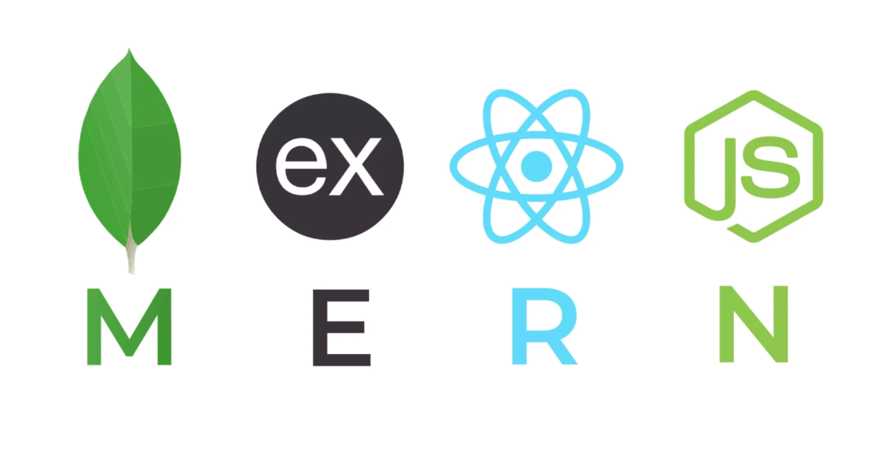

<h1 align="center">Patient Chart: 👩‍💻 Loren Franco</h1>

| Demographics                 | Patient Info                                                                                                                                                                                                                                                                                                                                                                                                                                                                            |
| ---------------------------- | --------------------------------------------------------------------------------------------------------------------------------------------------------------------------------------------------------------------------------------------------------------------------------------------------------------------------------------------------------------------------------------------------------------------------------------------------------------------------------------- |
| **Name**                     | Loren Franco                                                                                                                                                                                                                                                                                                                                                                                                                                                                            |
| **DOB  (Dev OnBoarding)** | June 2023 (Started Coding)                                                                                                                                                                                                                                                                                                                                                                                                                                                              |
| **Location**                 | 📍New Jersey                                                                                                                                                                                                                                                                                                                                                                                                                                                                            |
| **Occupation**               | Clinical Informatics Analyst @ <a href="https://www.summithealth.com/about-us">Summit Health CityMD</a>                                                                                                                                                                                                                                                                                                                                                                                                                                     |
| **Primary Concern**          | Full-Stack Fluency                                                                                                                                                                                                                                                                                                                                                                                                                                                                |
| **Languages Spoken**         |      |
| **DCE  (Durable Coding Equipment)**                | 
Macbook Pro M4 Max

Micro ATX

GPU: RTX 3060TI Vision CASE: Lian Li 011 Mini (Snow White) CPU: AMD Ryzen 9 5900x CPU COOLER: Corsair H100i Capellix (White) MOBO: AS Rock B550m Pro4 SE RAM: Corsair Vengeance RGB Pro SL 64GB (4x16GB)  (White) STORAGE: Corsair MP600 PRO LPX 1TB M.2 NVMe PSU: Corsair SF750 Platinum SFF

| **Allergies**                | 🍝 Eggplant parmesan & 🦀 Soft Shell Crab    **Reactivity**: Moderate   **Criticality**: Severe                                                                                                                                                                                                                                                                                                                                                                                |
| **Care Plan (Learning & Goals)**                | - 🚀 End of 2025: Graduate from Codecademy's Full Stack Developer Bootcamp - 📚 Personal Project: Finalize build on a Staff-Facing, Patient Check-In Website                                                                                                                                                                                                                                                                                                                                                                                 |
 

 

 🩺 Vitals (Toolkit) 
 

| Vital Sign           | Value/Range                      |
| -------------------- | -------------------------------- |
| **Spreadsheets**     |  |
| **IDEs/Editors**      |                |
| **Data Warehousing** |            |
| **Visualization**    |                 |
| **Frameworks**    |                    |
| **Collaboration**    |      |
| **Other Tools**      |       |

 

 

🩺 Past Medical (Project) History
 
📊 Healthcare Analytics Dashboard for Google Fiber Capstone Project <a href="https://www.linkedin.com/in/loren-franco/details/certifications/277342974/multiple-media-viewer?profileId=ACoAAB_zXPYBXF7YpXzKKkZGqTaeGng7MqNC0Rc&treasuryMediaId=1714090092930&type=DOCUMENT&lipi=urn%3Ali%3Apage%3Ad_flagship3_profile_view_base_certifications_details%3BhNe5gweZR4qen3Ae5SR%2FAg%3D%3D">Executive Summary</a>,  
<a href="https://public.tableau.com/views/GoogleBICapstone_GoogleFiber/RepeatCallsDashboard?:language=en-US&:sid=&:redirect=auth&:display_count=n&:origin=viz_share_link">Tableau Dashboard</a> 
 🖥️ <a href="https://lorenfranco.github.io">Personal Portfolio Website </a> – Full-stack build in progress  

 

 

🩺 Labs & Imaging (Certifications)

 

 <a alt="certificate link" src="https://www.codecademy.com/profiles/lor06/certificates/5cafb2d937090210d7df3652">Analyze Data with SQL Certificate</a>
  
  <a alt="certificate link"src="https://www.credly.com/badges/32d5fc90-2a25-41fb-84df-bdfd196241a8/linked_in_profile">Google Business Intelligence Certificate</a>
 
<a src="https://www.credly.com/badges/dcc51ad0-2e37-4819-93c7-ab8bba664991/public_url">Google Data Analytics Certificate</a>

